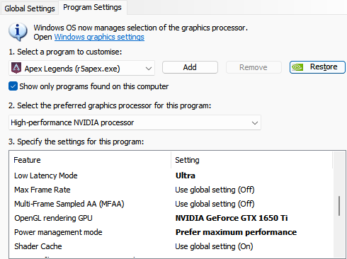
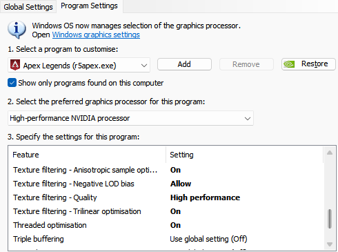
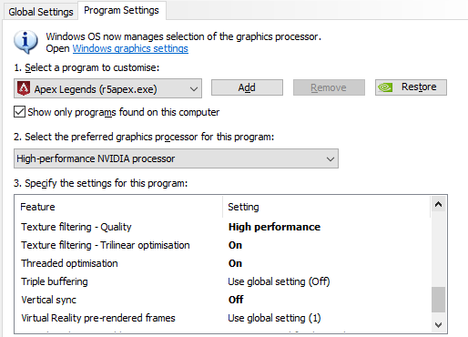

# Apex Config

## Credits
[deaFPS](https://github.com/deaFPS/apex-configs-by-deafps) for the base config, check their repo out for more info.

## Launch Options

Right click Apex Legends in steam, click Properties and paste this into Launch Options:
- `+exec autoexec.cfg +exec optimise.cfg -preload +fps_max 142 -high -dxlevel 95 -forcenovsync`

## Configs

To use these configs, paste autoexec.cfg, videoconfig.txt, and optimise.cfg in:
- `C:\Program Files (x86)\Steam\steamapps\common\Apex Legends\cfg`

## Nvidia Settings
These are settings I use for some games on weaker hardware, if you know what you're doing feel free to modify them.

